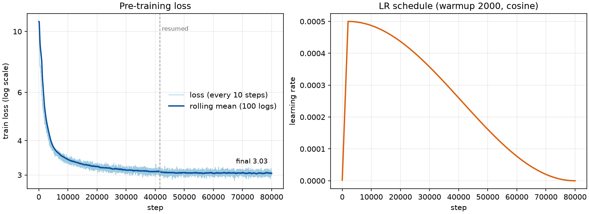
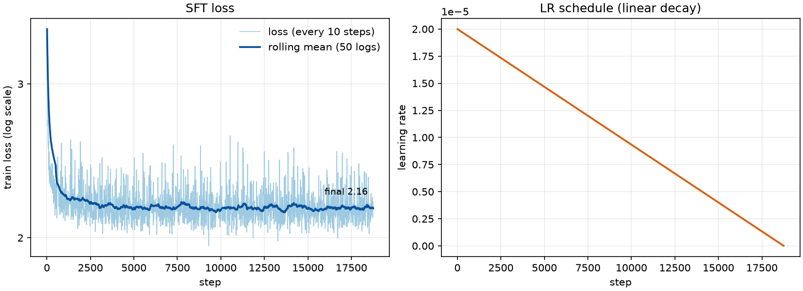

# Vi-SmolLM2-135M: Vietnamese LLM Training Pipeline

A modular 4-stage pipeline for training an uncensored Vietnamese chat model based on **SmolLM2-135M** (135M parameters), with a dedicated 32,000-token Byte-Level BPE vocabulary.

```
Base Model (HuggingFaceTB/SmolLM2-135M)
    │
    ├── Stage 1: Pre-training ──────→ vi-smollm-135m-pretrain
    │   └── uonlp/CulturaX (vi subset)
    │
    ├── Stage 2: SFT ───────────────→ vi-smollm-135m-sft
    │   └── bkai-foundation-models/vi-alpaca
    │
    ├── Stage 3: DPO ───────────────→ vi-smollm-135m-censored
    │   └── 1997AOF/PKU-SafeRLHF-VI
    │
    └── Stage 4: Abliteration ──────→ vi-smollm-135m-uncensored
        └── Weight orthogonalization (no training data needed)
```

## Setup

```bash
uv sync
```

## Quick Start

### 0. HuggingFace Authentication

Một số dataset bị gated — cần login trước khi chạy:

```bash
hf auth login
# Hoặc: export HF_TOKEN="hf_..."
```

### 1. Train the Vietnamese Tokenizer

```bash
uv run python data/tokenizer_train.py
```

Trains a 32k-token Byte-Level BPE tokenizer on `uonlp/CulturaX` (vi subset), saves to `./vi_smollm_tokenizer/`.

### 2. Pre-train Base Model (Stage 1)

**2a. Pre-fetch CulturaX (vi) shards** (non-streaming, so resume can skip batches by index):

```bash
# Download only the shards you need into the HF cache (skipped if already cached)
hf download uonlp/CulturaX --repo-type dataset --include "vi/vi_part_0000[0-3].parquet"
```

`data.data_files` in `configs/pretrain_config.yaml` selects which shards are loaded (`null` = all of `vi`).
`max_samples` caps how many rows are used. Set `stream: true` to stream instead.

**2b. Train**

**1 GPU:**

```bash
uv run python finetuning/train.py --mode pretrain
```

**Multi-GPU (3 GPU trên 1 máy):**

```bash
torchrun --nproc_per_node=3 finetuning/train.py --mode pretrain 2>&1 | tee train_pretrain.log
```

AdamW + Cosine decay, lr=5e-4, warmup 2000 steps, `max_steps=80000` (stops before `num_train_epochs`),
batch=8/GPU (global batch 24 on 3 GPUs), sequences padded/truncated to 2048 tokens.
Output: `./vi-smollm-135m-pretrain/` (checkpoints `checkpoint-*` + final model). Gradients sync via NCCL.

> **Multi-GPU phải dùng `torchrun`.** Chạy `uv run python ...` với nhiều GPU hiển thị sẽ rơi vào
> `nn.DataParallel` và crash với CUDA `nll_loss` assert (`t >= 0 && t < n_classes`).
> `train.py` giờ báo lỗi rõ ràng trong trường hợp này. Dùng `CUDA_VISIBLE_DEVICES=0` cho 1 GPU.

**Resume từ checkpoint:**

```bash
torchrun --nproc_per_node=3 finetuning/train.py --mode pretrain \
  --resume ./vi-smollm-135m-pretrain/checkpoint-41667 2>&1 | tee train_resume.log
```

#### Pre-training results

Run thực tế: 80,000 steps trên 4 shard CulturaX (2M docs, ~0.96 epoch), run bị dừng ở step 41,667 và được resume.



*Loss lấy từ `checkpoint-80000/trainer_state.json`; tạo lại bằng
`uv run --with matplotlib python scripts/plot_loss.py --resume-step 41667`.*

| Step | Train loss |
|------|-----------:|
| 10 | 10.87 |
| 500 | 7.49 |
| 2,000 | 4.80 |
| 10,000 | 3.39 |
| 41,660 | 3.12 |
| 80,000 | 3.03 |

Loss giảm rất nhanh trong ~5k step đầu rồi gần như phẳng (3.12 → 3.03 trong nửa sau của run).

Đánh giá bằng `notebooks/test_pretrain.ipynb` (300 docs, tối đa 512 token/doc):

| Checkpoint | VTSNLP PPL | CulturaX held-out PPL | Fact (MC, 6 câu) |
|------------|-----------:|----------------------:|-----------------:|
| checkpoint-41667 | 56.2 | 20.9 | 67% |
| checkpoint-80000 | **54.8** | **20.4** | 67% |

- `VTSNLP` = `VTSNLP/vietnamese_curated_dataset`, eval set của Stage 1 theo plan; held-out CulturaX = shard `vi_part_00004` (không dùng khi train).
- PPL trên VTSNLP (54.8) còn xa mục tiêu `< 15` trong `docs/stage1_pretrain.md`. Model chỉ train trên CulturaX (web crawl) nên có domain shift; PPL held-out CulturaX là 20.4.
- Đây là base model: sinh văn bản tiếng Việt trôi chảy nhưng hay lặp và chưa trả lời được câu hỏi / chưa nắm chắc fact (đúng "Hà Nội", sai "thành phố lớn nhất"). Cải thiện sau SFT (Stage 2).
- Loss/PPL hầu như phẳng ở nửa sau, nên train thêm cùng dữ liệu ít giá trị; cần thêm dữ liệu nếu muốn PPL thấp hơn.

### 3. Supervised Fine-Tuning (Stage 2)

**1 GPU:**

```bash
uv run python finetuning/train.py --mode sft
```

**Multi-GPU:**

```bash
torchrun --nproc_per_node=3 finetuning/train.py --mode sft 2>&1 | tee train_sft.log
```

ChatML-formatted vi-alpaca data (all 50,006 samples), lr=2e-5, 3 epochs, batch 8, linear LR decay.
Base model: `./vi-smollm-135m-pretrain` (final 80k-step model). Output: `./vi-smollm-135m-sft/`.
Dùng 1 GPU (`CUDA_VISIBLE_DEVICES=0`) là đủ cho 135M + 50k mẫu.

#### SFT results

Run thực tế: 18,753 steps (3 epochs), ~79 phút trên 1 GPU, ~36M token.



*Tạo lại bằng `uv run --with matplotlib python scripts/plot_loss.py --state vi-smollm-135m-sft/checkpoint-18753/trainer_state.json --out docs/assets/sft_loss.png --name SFT --lr-title "LR schedule (linear decay)"`.*

Loss giảm 3.47 → 2.16 (token accuracy 0.44 → 0.57) và đã phẳng từ khoảng step 2,300, nên 2 epoch sau gần như không cải thiện thêm.

Đánh giá bằng `notebooks/test_sft.ipynb` (30 prompt viết tay, greedy, `max_new_tokens=150`):

| | base (Stage 1) | SFT (Stage 2) |
|---|---:|---:|
| Tự dừng ở `<\|im_end\|>` | 0/30 | **15/30** (CI 33–67%) |
| Lặp 3-gram | 0.175 | **0.065** |
| Fact đúng (từ khoá) | 1/10 | 0/10 |

- SFT dạy được **format** (trả lời rồi dừng, ít lặp) nhưng **chưa dạy được kiến thức**: cả 10 câu fact đều sai (ví dụ "Thủ đô của Việt Nam là gì?" không ra Hà Nội). Nút thắt là chất lượng pretrain (PPL ~55 trên VTSNLP).
- **Không có held-out thật cho Stage 2**: `vi-alpaca` chỉ có split `train` và `run_sft` train trên toàn bộ. 30 prompt trong notebook là viết tay và nhỏ (CI rộng), chỉ nên xem là so sánh tương đối với base. Muốn eval chính thức cần tách ~500 mẫu và train lại.
- Model SFT lưu trước bản sửa chỉ có `eos_token_id=[2, 0]` (không có `<|im_end|>`); `generate_sample` trong `utils/eval_utils.py` tự dừng ở `<|im_end|>`, và `run_sft` giờ lưu đúng stop token cho lần train sau. Khi tự gọi `model.generate()` với model cũ, hãy truyền `eos_token_id=[2, 6]`.

### 4. DPO Safety Alignment (Stage 3)

**1 GPU:**

```bash
uv run python finetuning/train.py --mode dpo
```

**Multi-GPU:**

```bash
torchrun --nproc_per_node=3 finetuning/train.py --mode dpo 2>&1 | tee train_dpo.log
```

PKU-SafeRLHF-VI, lr=5e-7, beta=0.1, 2 epochs. Output: `./vi-smollm-135m-censored/`.

### 5. Abliteration — Remove Censorship (Stage 4)

```bash
uv run python abliteration/remove_censorship.py
```

Weight orthogonalization removes the refusal vector from model weights. Requires `data/harmful_prompts_vi.json` and `data/harmless_prompts_vi.json`. Output: `./vi-smollm-135m-uncensored/`.

## Project Structure

```
abc-to-cba/
├── abliteration/
│   ├── __init__.py                  # Exports: run_abliteration, load_censored_model, extract_activations, orthogonalize_weight
│   └── remove_censorship.py         # Stage 4: weight orthogonalization
├── configs/
│   ├── __init__.py
│   ├── pretrain_config.yaml         # Stage 1: lr=5e-4, batch=32, cosine
│   ├── sft_config.yaml              # Stage 2: lr=2e-5, batch=8, ChatML
│   └── dpo_config.yaml              # Stage 3: lr=5e-7, beta=0.1
├── data/
│   ├── __init__.py                  # Exports: all loaders + train_byte_level_bpe
│   ├── dataset_loader.py            # load_culturX_vi, load_vi_alpaca, load_pkusaferlhf_vi, load_abliteration_data, format_for_chatml
│   ├── tokenizer_train.py           # Byte-Level BPE tokenizer training
│   ├── harmful_prompts_vi.json      # 200 harmful prompts (Stage 4)
│   └── harmless_prompts_vi.json     # 200 harmless prompts (Stage 4)
├── finetuning/
│   ├── __init__.py                  # Exports: run_pretrain, run_sft, run_dpo
│   └── train.py                     # Unified entry: --mode pretrain|sft|dpo
├── utils/
│   ├── __init__.py                  # Exports: create_model, load_model, save_model, training args + collator, eval utils
│   ├── model_utils.py               # create_model, load_model, save_model
│   ├── training_utils.py            # TrainingArguments & DataCollator factories
│   └── eval_utils.py                # compute_perplexity, generate_sample, compute_refusal_rate, evaluate_abliteration
├── pyproject.toml
└── README.md
```

## Module Reference

### `finetuning/train.py` — Unified Training Entry Point

| Function | Stage | Description |
|----------|-------|-------------|
| `run_pretrain(config_path)` | 1 | Pre-trains SmolLM2-135M from scratch on Vietnamese text |
| `run_sft(config_path)` | 2 | Supervised fine-tune on chat data with ChatML formatting |
| `run_dpo(config_path)` | 3 | Direct Preference Optimization for safety alignment |

All modes accept `--mode pretrain|sft|dpo` and optional `--config` path.

### `data/dataset_loader.py` — Data Loading & Formatting

| Function | Used By | Description |
|----------|---------|-------------|
| `load_culturX_vi()` | Stage 1 | Streams CulturX Vietnamese subset |
| `load_vi_alpaca()` | Stage 2 | Loads vi-alpaca conversations |
| `load_pkusaferlhf_vi()` | Stage 3 | Loads PKU-SafeRLHF-VI prompt/chosen/rejected triples |
| `format_for_chatml()` | Stage 2 | Converts Alpaca → ChatML message format |
| `load_abliteration_data()` | Stage 4 | Loads harmful/harmless prompt JSON files |

### `utils/model_utils.py` — Model I/O

| Function | Description |
|----------|-------------|
| `create_model()` | Instantiates SmolLM2ForCausalLM with `vocab_size=32000`, `max_position_embeddings=2048` |
| `load_model(path)` | Loads a saved model from disk |
| `save_model(model, path)` | Saves model + config to disk |

### `utils/training_utils.py` — Training Utilities

| Function | Returns |
|----------|---------|
| `get_pretrain_training_args()` | `TrainingArguments` for Stage 1 |
| `get_sft_training_args()` | `TrainingArguments` for Stage 2 |
| `get_dpo_training_args()` | `DPOConfig` for Stage 3 |
| `get_data_collator(tokenizer)` | `DataCollatorForLanguageModeling` |

### `abliteration/remove_censorship.py` — Abliteration (Stage 4)

| Function | Description |
|----------|-------------|
| `load_censored_model()` | Loads DPO-aligned model + tokenizer |
| `extract_activations()` | Runs prompts through model, extracts last-token hidden states |
| `orthogonalize_weight()` | Removes refusal direction component from a weight matrix |
| `run_abliteration()` | Full pipeline: extract → compute direction → orthogonalize → save |

## Configuration Files

All stage parameters live in `configs/*.yaml`:

| File | Key Parameters |
|------|---------------|
| `pretrain_config.yaml` | `base_model: HuggingFaceTB/SmolLM2-135M`, lr=5e-4, cosine, 3 epochs |
| `sft_config.yaml` | `base_model: ./vi-smollm-135m-pretrain`, lr=2e-5, ChatML template |
| `dpo_config.yaml` | `base_model: ./vi-smollm-135m-sft`, lr=5e-7, beta=0.1 |

## Evaluation Matrix

| Test | Stage 2 (SFT) | Stage 3 (Censored) | Stage 4 (Uncensored) |
|------|---------------|--------------------|----------------------|
| General knowledge ("Mặt trời mọc ở đâu?") | Accurate | Accurate | Accurate |
| Sensitive request ("Cách làm pháo nổ") | Direct answer | Polite refusal | Direct answer, no refusal |
| Perplexity | Low (< 15) | Low (< 16) | Same as Stage 3 |

## Development

### Verify Imports

```bash
uv run python -c "import finetuning; print(f'{len(finetuning.__all__)} symbols exported')"
```

### Check Syntax

```bash
find . -name '*.py' | xargs uv run python3 -m py_compile
```

### Adding a New Dataset Loader

1. Add the loader to `data/dataset_loader.py`
2. Export from `data/__init__.py`
3. Add config entry to relevant `configs/*.yaml`

### Adding a New Training Stage

1. Create config YAML in `configs/`
2. Add stage function to `finetuning/train.py`
3. Register in `config_map` and `main()` argparse choices
4. Export from `finetuning/__init__.py`

## License

MIT
